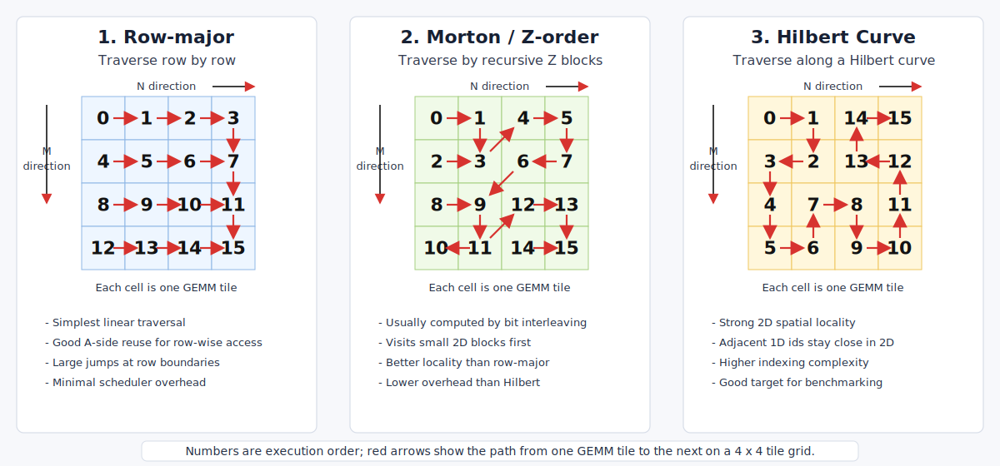

# Intel XPU GEMM Scheduling Optimization

Bring advanced GEMM tile scheduling ideas from Hopper-oriented work to Intel
XPU, then evaluate whether they improve locality, load balance, and end-to-end
matrix multiplication throughput.

## Background

Modern GEMM performance is not only about the inner compute micro-kernel. Tile
scheduling can change cache locality, memory traffic, load balance, and the
amount of useful overlap between compute and data movement.

Recent Hopper-focused work explores scheduling strategies such as Hilbert curve
ordering for GEMM tiles. A related paper also discusses a CA strategy that is
interesting to evaluate on non-NVIDIA hardware. This project asks whether these
ideas can be mapped cleanly to Intel XPU and whether the mapping produces
measurable wins.

## Official Starting Point

[SYCL-TLA](https://github.com/intel/sycl-tla), short for SYCL Templates for
Linear Algebra, is Intel's CUTLASS 3.x-style template library for Intel GPUs. It
contains high-performance GEMM implementations and examples that are useful as
the starting point for this project.

Recommended examples to study and run first:

| Example | Why it matters |
|---------|----------------|
| [`00_bmg_gemm`](https://github.com/intel/sycl-tla/tree/main/examples/00_bmg_gemm) | First baseline to run: BF16 GEMM using DPAS, 2D block copy, and a prefetch pipeline. |
| [`01_bmg_gemm_with_collective_builder`](https://github.com/intel/sycl-tla/tree/main/examples/01_bmg_gemm_with_collective_builder) | Shows how to assemble a GEMM kernel with the Collective Builder API. |
| [`02_bmg_gemm_mixed_dtype`](https://github.com/intel/sycl-tla/tree/main/examples/02_bmg_gemm_mixed_dtype) | Mixed-dtype GEMM reference. |
| [`03_bmg_gemm_streamk`](https://github.com/intel/sycl-tla/tree/main/examples/03_bmg_gemm_streamk) | Stream-K scheduling reference and an important comparison point for tile scheduling work. |
| [`04_bmg_grouped_gemm`](https://github.com/intel/sycl-tla/tree/main/examples/04_bmg_grouped_gemm) | Grouped GEMM reference. |
| [`05_bmg_gemm_with_epilogues`](https://github.com/intel/sycl-tla/tree/main/examples/05_bmg_gemm_with_epilogues) | Epilogue fusion examples such as bias and activation. |
| [`08_bmg_gemm_f8`](https://github.com/intel/sycl-tla/tree/main/examples/08_bmg_gemm_f8) | FP8 GEMM reference. |
| [`13_bmg_gemm_bias`](https://github.com/intel/sycl-tla/tree/main/examples/13_bmg_gemm_bias) | Bias fusion reference. |

The intern should treat `00_bmg_gemm` as the first reproducible baseline, then
compare the Hilbert and CA scheduling prototypes against the relevant SYCL-TLA
baseline examples.

## Initial Scheduler Scan

The official BMG examples do not appear to use Morton Z-order or Hilbert-order
tile traversal today.

Observed scheduler behavior in SYCL-TLA:

- `00_bmg_gemm`, `01_bmg_gemm_with_collective_builder`, `08_bmg_gemm_f8`, and
  `13_bmg_gemm_bias` use the default `GemmUniversal` scheduler. On Intel Xe,
  the default persistent scheduler currently maps to the CUTLASS-style
  `PersistentTileSchedulerSm90` path.
- The default persistent scheduler maps a linear work id to `(M, N)` tile
  coordinates with `RasterOrder::AlongN` or `RasterOrder::AlongM`, plus a small
  cluster swizzle controlled by `log_swizzle_size`. This is a linear raster
  ordering with grouped minor-dimension swizzling, not Morton bit-interleaving
  and not a Hilbert curve.
- `03_bmg_gemm_streamk` explicitly uses `cutlass::gemm::StreamKScheduler`. Its
  main scheduling idea is K-dimension decomposition for DataParallel, Split-K,
  and hybrid Stream-K modes. After choosing the output tile id, it still maps
  the output tile through the same style of linear `(M, N)` tile mapping.
- `04_bmg_grouped_gemm` explicitly uses `cutlass::gemm::GroupScheduler` and
  passes `RasterOrderOptions::AlongN` in the example. The grouped scheduler also
  walks linear tile ids across GEMM groups and applies the same AlongM/AlongN
  raster-style mapping inside each group.

This makes Morton Z-order and Hilbert traversal good project targets: they are
not just toggles in the current examples, and they should be implemented as new
tile-id to `(M, N)` mapping policies to compare against the existing
AlongM/AlongN raster baseline and Stream-K baseline.

## Scheduler Traversal Orders



The figure shows three ways to map a 1D execution order to a 2D GEMM tile grid.
Each cell is one output tile `(M_tile, N_tile)`, and the number in the cell is
the order in which the scheduler visits that tile.

- Row-major traversal is the simplest baseline. It walks across `N` for a fixed
  `M`, then jumps to the next row. The indexing cost is minimal, but the jump at
  every row boundary can hurt locality.
- Morton, or Z-order, recursively visits small 2D blocks. It is usually computed
  by interleaving the bits of the `M` and `N` tile coordinates. It improves 2D
  locality over plain row-major traversal with relatively low indexing overhead.
- Hilbert traversal follows a space-filling curve with stronger locality than
  Morton in many cases because consecutive 1D ids tend to stay close in 2D. The
  tradeoff is a more complicated index mapping.

For this project, the current SYCL-TLA AlongM/AlongN raster order should be the
baseline. Morton/Z-order can be an intermediate scheduler to implement because
it is simpler than Hilbert and helps separate two effects: whether Intel XPU
benefits from better 2D tile locality at all, and whether Hilbert's extra
locality is worth its higher indexing overhead.

## Project Goal

Implement and evaluate GEMM scheduling optimizations on Intel XPU:

1. Build two baselines: the official SYCL-TLA GEMM example and oneDNN GEMM on
  Intel XPU.
2. Map Morton/Z-order tile traversal to Intel XPU GEMM kernels as a simple
   locality-improving scheduler.
3. Map the Hopper Hilbert curve scheduling strategy to Intel XPU GEMM kernels.
4. Map the CA strategy from the referenced paper to Intel XPU.
5. Compare the new schedulers against both baselines on representative
   GEMM shapes.

The final result should be a clear recommendation: which scheduling policy works
well on Intel XPU, which does not, and why. The stretch goal is to outperform
oneDNN on selected shapes and explain the result with cache and memory-behavior
analysis.

## Scope

The project should focus on scheduling and evaluation, not on rewriting the
entire GEMM stack.

Expected work:

- Understand the existing Intel XPU GEMM kernel path and identify where tile
  scheduling is decided.
- Implement a Morton/Z-order tile scheduler suitable for Intel XPU execution.
- Implement a Hilbert-order tile scheduler suitable for Intel XPU execution.
- Implement the CA scheduling strategy from the paper in the same scheduling
  interface, when possible.
- Build a benchmark suite covering square, skinny, tall, and LLM-relevant GEMM
  shapes.
- Measure throughput, cache behavior if available, occupancy or EU utilization,
  and sensitivity to matrix sizes.
- Document cases where the mapping differs from Hopper due to Intel XPU memory
  hierarchy, work-group execution, or kernel launch constraints.

## XPU Cache Analysis with unitrace

Use `unitrace` from Intel oneAPI as the first profiling tool for this project.
It can trace SYCL / Level Zero execution and collect GPU metric groups exposed
by the Intel driver and hardware.

Suggested workflow:

1. Query available metric groups on the target XPU:

  ```bash
  unitrace --metric-query ./gemm_benchmark
  ```

2. Run the SYCL-TLA baseline, oneDNN baseline, Morton/Z-order scheduler, and
  Hilbert scheduler with the same GEMM shapes and the same selected metric
  group. Prefer memory/cache-related groups when available; exact counter names
  vary by GPU generation and driver.

  ```bash
  unitrace --device-timing --group <metric-group> ./gemm_benchmark
  ```

3. Record at least these signals when exposed by the metric group:

  - kernel time and achieved TFLOPS
  - memory bandwidth
  - L3 / cache hit rate or miss count
  - SLM usage or stalls, if available
  - EU active / stall metrics, if available

4. Compare cache and memory behavior across schedulers. The main question is
  whether Morton/Z-order or Hilbert reduces cache misses or improves bandwidth
  enough to offset its scheduler-indexing overhead.

The final report should include both performance numbers and a cache-analysis
table. If a scheduler is faster than oneDNN, explain whether the win comes from
better locality, better load balance, reduced memory traffic, or shape-specific
effects.

## Suggested Milestones

1. Study the official SYCL-TLA tutorial and understand how `00_bmg_gemm` is
  built from tile shape, copy pipeline, mainloop, epilogue, and scheduler.
2. Benchmark the tutorial GEMM example against oneDNN GEMM on Intel XPU. Treat
  both as baselines.
3. Implement Morton/Z-order tile scheduling, validate correctness, and compare
  it with both baselines.
4. Implement Hilbert tile scheduling, validate correctness, and compare it with
  both baselines.
5. Try to outperform oneDNN on selected GEMM shapes, and use `unitrace` cache /
  memory metrics to explain cache misses, bandwidth behavior, and scheduler
  overhead.

## References

- [Outperforming cuBLAS on H100: a Worklog](https://cudaforfun.substack.com/p/outperforming-cublas-on-h100-a-worklog)
- [arXiv:2601.16294](https://arxiv.org/pdf/2601.16294)
- [SYCL-TLA](https://github.com/intel/sycl-tla)
